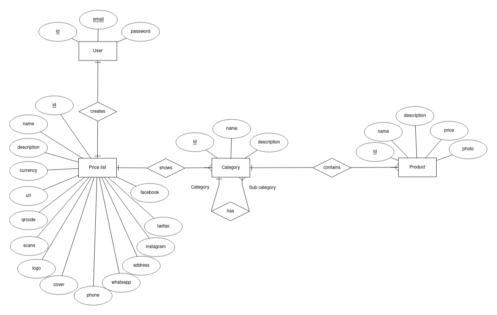

# QRPriceList
QRPriceList is a web application and API built with Laravel that allows users to create customized price lists by adding categories and products, facilitating the easy exchange of price lists with customers via URL or QR codes. This repository contains the source code for the QRPriceList project.

## Libraries Used
### Backend
* propaganistas/laravel-phone: A Laravel package for phone number validation and formatting.simplesoftwareio/
* simple-qrcode: A Laravel package for generating QR codes.
* spatie/laravel-query-builder: A Laravel package for building queries using request parameters.
* yajra/laravel-datatables-oracle: A Laravel package for creating data tables with sorting, searching, and pagination.

### Frontend
* Bootstrap: A popular CSS framework for creating responsive and visually appealing web pages.

## Entity-Relationship Diagram

The following is the Entity-Relationship (ER) diagram representing the database structure of the QRPriceList project:

## License

The QRPriceList project is licensed under the [MIT License](https://opensource.org/license/mit/).

## Contact

If you have any questions or suggestions regarding the QRPriceList project, feel free to contact me at gilbertojosecarrilloparra@gmail.com.